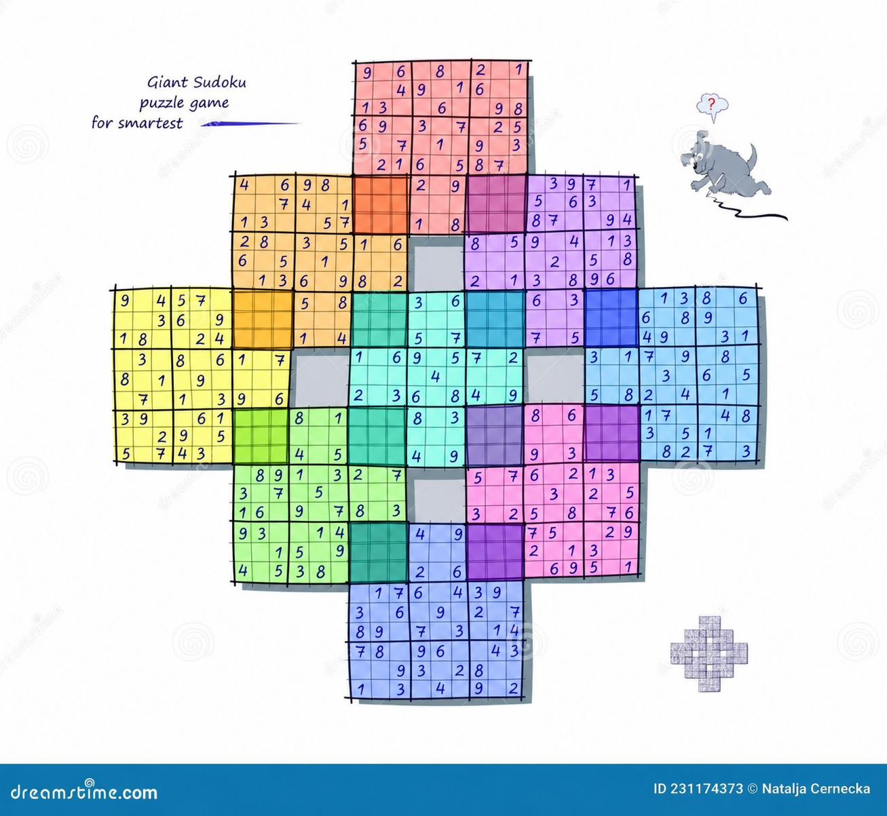

# 🧩 Sudoku Solver (Tradicional e Samurai)

Um solucionador e gerador de Sudoku completo desenvolvido em Python. O projeto suporta tanto o **Sudoku Tradicional (9x9)** quanto o complexo **Sudoku Samurai (33x33)**, oferecendo múltiplos algoritmos de resolução, cálculo de métricas de desempenho e relatórios de execução.

## 🚀 Como executar

Para executar o projeto, basta estar dentro da pasta `Sudoku` e rodar a `main`:

```bash
python main.py
```

Em ambientes onde o comando `python` está configurado corretamente, também é possível executar:

```bash
python main
```

## ✨ Funcionalidades

### 🎮 Dois modos de jogo

* 🟩 **Sudoku Tradicional (9x9):** o clássico puzzle lógico.
* 🟪 **Sudoku Samurai (33x33):** conjunto de tabuleiros de Sudoku 9x9 interconectados, com regiões de sobreposição e regras compartilhadas.

#### 🖼️ Exemplo do Sudoku Samurai

A imagem abaixo representa o formato do Sudoku Samurai utilizado no projeto:


O Sudoku Samurai possui um algoritmo próprio para:

* Estruturação da matriz global;
* Identificação das regiões pertencentes a cada Sudoku;
* Tratamento das regiões de sobreposição;
* Validação das regras entre os tabuleiros;
* Geração e resolução utilizando Backtracking adaptado;
* Exibição estruturada do tabuleiro no terminal.

### 🎯 Níveis de dificuldade

O projeto possui três níveis de dificuldade:

* **Fácil**
* **Médio**
* **Difícil**

A dificuldade controla dinamicamente a quantidade de números removidos do tabuleiro durante a geração do puzzle.

### 🖥️ Visualização no terminal

Os tabuleiros são exibidos diretamente no terminal utilizando cores ANSI para facilitar a identificação das células:

* Células vazias;
* Números originais do puzzle;
* Números preenchidos pelo algoritmo.

O Sudoku Samurai possui uma visualização própria para representar corretamente sua estrutura e as regiões de sobreposição.

### 📊 Métricas e logs

Durante a execução são coletadas métricas de desempenho, incluindo:

* Tempo de execução;
* Quantidade de blocos válidos;
* Porcentagem de cobertura da matriz;
* Resultados dos algoritmos utilizados.

Os resultados da bateria de testes também podem ser salvos em arquivo para posterior análise.

---

## 🧠 Métodos de resolução

Para o **Sudoku Tradicional (9x9)**, o projeto disponibiliza quatro abordagens algorítmicas:

### 1. 🎲 Probabilidade com 1 Tentativa

Abordagem simplificada baseada em apenas 1 tentativa de preenchimento do tabuleiro.

### 2. 🎲 Probabilidade com N Tentativas

Método baseado em tentativas repetidas, utilizando um limite configurável de loops para encontrar uma solução válida.

### 3. 🧠 Backtracking

Implementação do algoritmo clássico de **Backtracking**, utilizando busca em profundidade (**DFS — Depth-First Search**) com retrocesso.

O algoritmo:

1. Localiza uma célula vazia;
2. Testa possíveis valores;
3. Verifica se o valor é válido;
4. Continua recursivamente;
5. Caso encontre um conflito, retorna à etapa anterior e tenta outra possibilidade.

> ⚠️ **Nota:** devido à complexidade das regiões de sobreposição e ao tamanho da matriz global `33x33`, o Sudoku Samurai utiliza exclusivamente e de forma automática um algoritmo de **Backtracking adaptado para múltiplos tabuleiros interconectados**.

---

## 🧩 Sudoku Samurai

O Sudoku Samurai utiliza uma matriz global `33x33` para representar os diferentes tabuleiros e suas regiões de sobreposição.

Cada Sudoku ocupa uma região `9x9` dentro da matriz global.

A configuração das posições dos tabuleiros é definida no arquivo:

```text
core/config.py
```

Exemplo de configuração:

```python
SAMURAI_CONFIG = [
    ("SUDOKU_A", (0, 12)),
    ("SUDOKU_B", (6, 18)),
    ("SUDOKU_C", (6, 6)),
    ("SUDOKU_D", (12, 0)),
    ("SUDOKU_E", (12, 12)),
    ("SUDOKU_F", (12, 24)),
    ("SUDOKU_G", (18, 6)),
    ("SUDOKU_H", (18, 18)),
    ("SUDOKU_I", (24, 12)),
]
```

As coordenadas representam a posição inicial de cada Sudoku dentro da matriz global.

As regiões compartilhadas entre os tabuleiros são tratadas como células pertencentes simultaneamente aos respectivos Sudokus.

---

## 📁 Estrutura do projeto

Para que a integração funcione corretamente, o projeto segue a seguinte organização:

## 📁 Estrutura do projeto

O projeto está organizado em módulos separados de acordo com suas responsabilidades, facilitando a manutenção e a integração entre os diferentes algoritmos de Sudoku.

```text
Sudoku/
├── main.py
│
├── core/
│   └── config.py
│
└── src/
    ├── SamuraiGame/
    │   ├── BoardSamuraiGeneration.py
    │   └── LogBoardGenerations.py
    │
    ├── Board.py
    ├── BoardGeneration.py
    ├── Probability.py
    └── Logs.py
```

### 📄 Descrição dos arquivos

| Arquivo                                     | Responsabilidade                                                                                                                                      |
| ------------------------------------------- | ----------------------------------------------------------------------------------------------------------------------------------------------------- |
| `main.py`                                   | Arquivo principal da aplicação, responsável pelo fluxo de execução e menus.                                                                           |
| `core/config.py`                            | Contém as configurações globais do projeto, incluindo as posições dos tabuleiros do Sudoku Samurai.                                                   |
| `src/Board.py`                              | Implementa as regras, validações e operações básicas dos tabuleiros de Sudoku.                                                                        |
| `src/BoardGeneration.py`                    | Responsável pela geração dos tabuleiros tradicionais e criação dos puzzles.                                                                           |
| `src/Probability.py`                        | Contém os algoritmos probabilísticos utilizados para resolução dos Sudokus.                                                                           |
| `src/Logs.py`                               | Responsável pelo registro e exportação dos resultados e métricas dos testes.                                                                          |
| `src/SamuraiGame/BoardSamuraiGeneration.py` | Implementa a geração e manipulação da estrutura do Sudoku Samurai, incluindo a matriz global, os tabuleiros individuais e as regiões de sobreposição. |

---

## ▶️ Execução

Entre na pasta do projeto:

```bash
cd Sudoku
```

Execute:

```bash
python main.py
```

A partir da `main`, o usuário poderá selecionar o tipo de Sudoku, nível de dificuldade e algoritmo de resolução quando aplicável.

---

## 📌 Observações

O projeto foi desenvolvido com foco em comparar diferentes estratégias de resolução de Sudoku, permitindo analisar não apenas se o tabuleiro foi resolvido, mas também o comportamento e desempenho de cada algoritmo.

O **Sudoku Samurai** possui uma implementação específica devido à necessidade de trabalhar com múltiplos tabuleiros, coordenadas globais e regiões compartilhadas.

---

## 👨‍💻 Autor

**Eu**